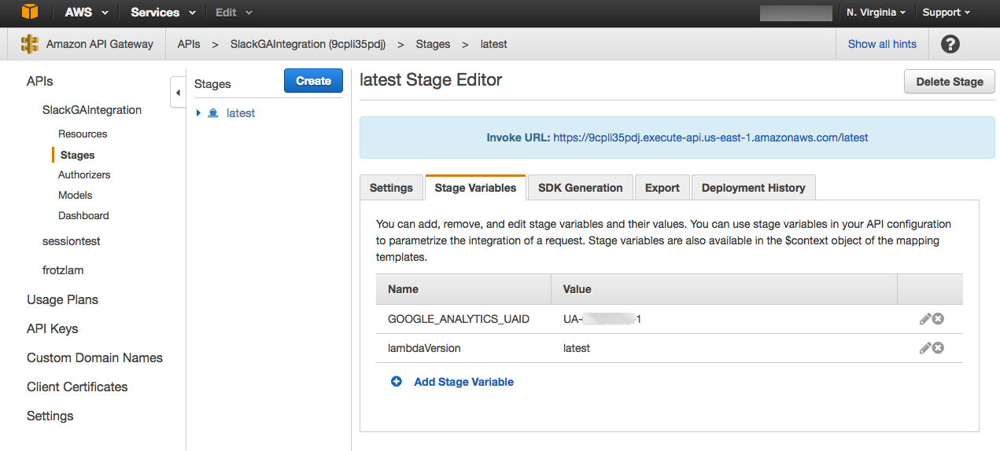

# Slackalytics

Slackalytics is a textual analysis bot built in Node.js that allows for deeper custom analytics by sending message strings to Google Analysis via Slacks realtime API and Google Analytics Measurement Protocol.

The original work was done by Nico Miceli. See his blog post here: [http://nicomiceli.com/slackalytics/](http://nicomiceli.com/slackalytics/) 

Created by [Nico Miceli](http://nicomiceli.com) and [Joe Zeoli](http://joezeoli.com)

This version uses AWS Lambda with AWS API Gateway thereby acheiving the result without any servers to manage at all.

[Claudiajs](https://claudiajs.com/) is used as the essential glue between simple nodejs function and all that AWS machinery.

Blog post on this port coming Real Soon Now(tm)

Change Log
------------

09/14/16 - reworked for AWS Lambda and friends using Claudiajs
- Moved the GOOGLE_ANALYTICS_UAID into an AWS API Gateway context param, removing all secrets from the code itself.
 
## Build

Since the whole thing is packaged as an npm package, you should be able to just use

`npm update`
  
To get the package ready for use

## Deployment

claudiajs handles the deployment to AWS Lambda and AWS API Gateway.

For convenience, package.json includes the necessary invocation so you can use npm run

`npm run create`

After creating the initial deployment, you can either configure the Google Analytics UAID via the AWS console, or you can simply do

`npm run configure`
  
And you'll be prompted to enter this secret. Note that the secret is NOT stored locally.

You can also use the AWS console and set the secret on the AWS API Gateway stage configuration:

###AWS Region

Note that the AWS us-east-1 region is assumed - change this in package.json.

[TODO: Source AWS region from build env](https://github.com/verveguy/slackalytics/issues/1)

After initial deployment, you'll have a new file claudia.json created. This is a generated build artifact that captures the information about your deployed instance, including the AWS Lambda object identifiers, etc. 

If you intend to update this instance from more than one place you may care to check this file in for convenience. Currently, it is being git ignored. 

### Redeployment

If you modify the code, you can easily *update* your deployed service using

`npm run redeploy`

## Removal

If you no longer want this service deployed on AWS, simply

`npm run destroy`

Claudiajs will remove the artifacts from AWS

